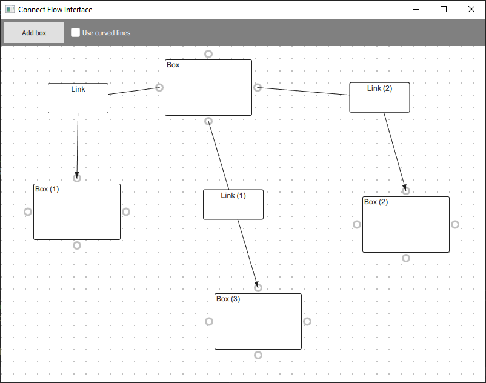

# Connect flow interface
This project shows a connect flow interface, on which you can put box components, which may be connected with links, in a similar way as e.g what is done in the Unreal blueprint system.

To connect 2 boxes, just move the cursor above the box connector from which you want to start to connect, click and maintain the left mouse button pressed, and drag to the box connector to which you mant to connect with, then to release the left mouse button.

There are 2 styles for the links, either in line or curve mode. This style may be changed dynamically.

I initally created this interface as a part of the Simple Path project (see: https://github.com/thesimplepath/The-Simple-Path)

