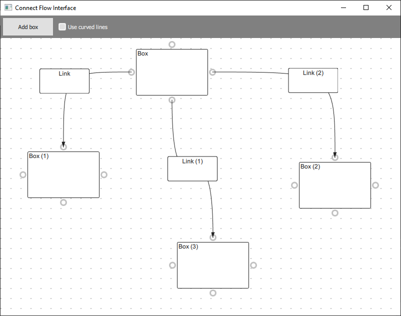
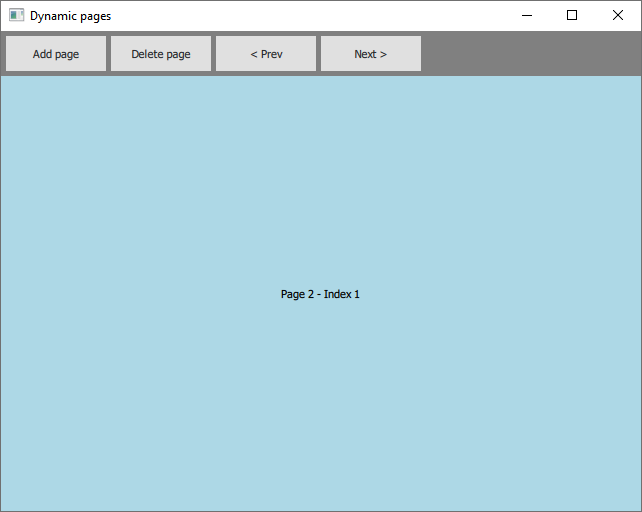
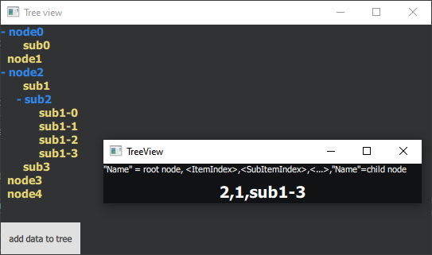

# Qt
This repository contains several demos and prototypes based on the Qt and Qml API.

## Connect flow interface
This project shows a connect flow interface, on which you can put box components, which may be connected with links, in a similar way as e.g what is done in the Unreal blueprint system.

This interface was originally created for the Simple Path application project, see:
https://github.com/thesimplepath/The-Simple-Path

## Dynamic pages
This project shows how to dynamically add and remove children components onto a view, by using a `ListModel`, associated with a `Repeater` in a `StackLayout` view.

## Tree view
This project shows how to create a basic tree view from a `ListView` component. The code is an implementation of the following article from the CodeProject website:
https://www.codeproject.com/Articles/632795/QML-TreeModel-and-TreeView

